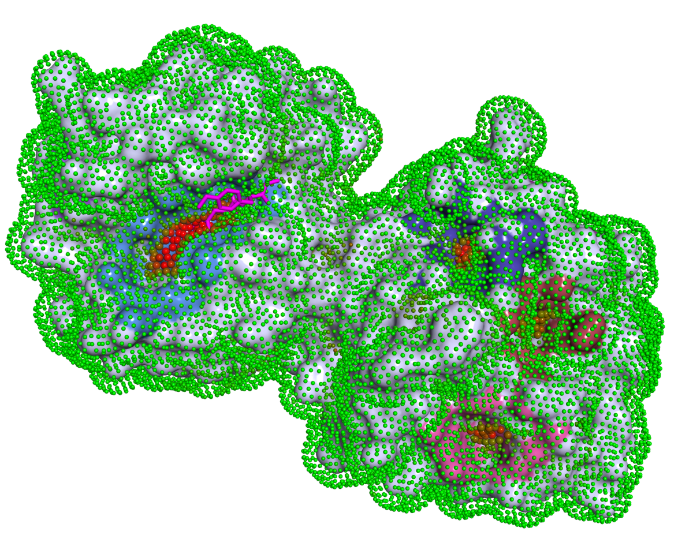
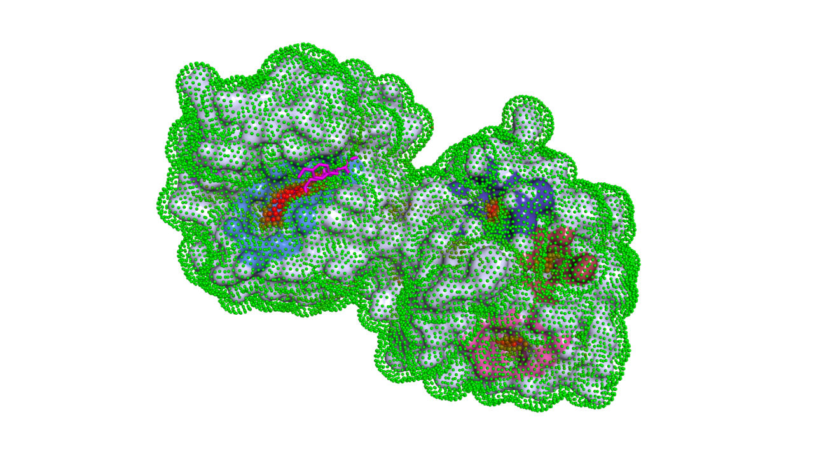
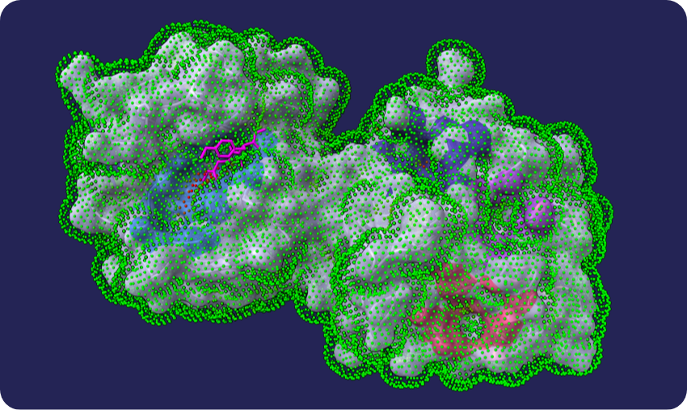
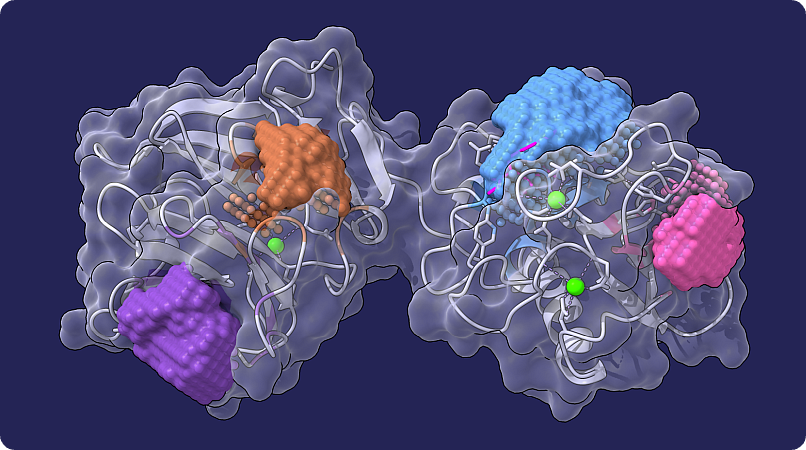
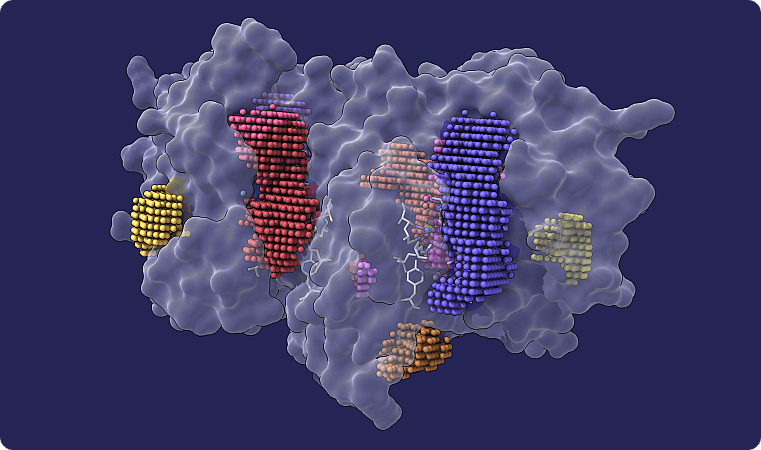

<p align="left">
    
</p>

# P2Rank User Guide

## Contents

1. [Introduction](#1-introduction)
2. [Quick Start](#2-quick-start)
3. [Choosing a Configuration Profile](#3-choosing-a-configuration-profile)
4. [Input Formats and Dataset Files](#4-input-formats-and-dataset-files)
5. [Understanding the Output](#5-understanding-the-output)
6. [Controlling Prediction Output](#6-controlling-prediction-output)
7. [Performance Tuning](#7-performance-tuning)
8. [Rescoring Predictions from Other Methods](#8-rescoring-predictions-from-other-methods)
9. [Advanced Features](#9-advanced-features)
10. [Common Recipes](#10-common-recipes)
11. [Troubleshooting](#11-troubleshooting)
12. [Reference](#12-reference)

## 1. Introduction

P2Rank is a stand-alone command-line tool for predicting ligand-binding sites from protein structure.
It uses a machine learning model (Random Forest) trained on known protein-ligand complexes to score
and cluster points on the protein's solvent-accessible surface (SAS). No external software, databases,
or template libraries are required: give P2Rank a structure file and it returns ranked pocket predictions.

### What P2Rank does

P2Rank predicts **where** small-molecule ligands are likely to bind on a protein surface. It outputs
a ranked list of putative binding pockets with scores, probabilities, pocket-lining residues, and
ready-to-open visualization scripts. Predictions are **ligand-agnostic**: P2Rank identifies sites
where *some* small-molecule ligand is likely to bind, not sites for any particular ligand of interest.

### Why use P2Rank

- **High success rate** at putting the true binding site in the top one or two ranked pockets, on
  standard benchmarks
- **Fast and scalable**: single-CPU prediction takes seconds per protein and the dataset mode
  processes many structures in parallel
- **No external dependencies**: no template database, no homology search, no other software
  required at prediction time
- **Standalone CLI** suitable for batch processing, scripting, and reproducible pipelines
- **Calibrated probabilities** in addition to raw scores, so ranking can be combined with a
  threshold
- **Adapts to structure type**: shipped configs for X-ray, AlphaFold/cryo-EM/NMR, and
  conservation-aware prediction
- **Rescores other tools' pockets** (Fpocket, Pocketeer, etc.), often improving their ranking
- **Rich output for downstream analysis**: SAS points, per-pocket descriptors, 3D pocket grids,
  PyMOL and ChimeraX visualizations
- **Open source** under MIT license

### P2Rank vs PrankWeb

| | P2Rank (CLI) | PrankWeb (web server) |
|---|---|---|
| Interface | Command line | Browser at [prankweb.cz](https://prankweb.cz) |
| Best for | Batch processing, scripting, custom configs, reproducible pipelines | Quick single-structure predictions with built-in 3D visualization |
| Conservation | Requires local setup | Integrated automatically |
| Downstream tools | Bring your own | Built-in docking, homology search |

Both run the same core prediction algorithm. Use PrankWeb when you need a fast look at one structure;
use P2Rank when you need to process many structures, customize parameters, or integrate predictions
into an automated pipeline.

### How it works (briefly)

P2Rank generates a set of points on the protein's solvent-accessible surface, computes local
chemical and geometric features for each point, and classifies them with a Random Forest model.
Points with high ligandability scores are clustered into pockets and ranked.
See the [README](../README.md) for publications and detailed algorithm descriptions.

<p align="center">
    
</p>
<p align="center"><i>
    Predicted pockets visualized in PyMOL. Each color represents a different predicted binding pocket.
    Green dots are SAS points on the non-pocket surface. Ligand molecules (sticks) are shown for reference.
</i></p>


## 2. Quick Start

### Requirements

- **Java 17 or later** (tested up to Java 26)
- **PyMOL** or **ChimeraX** (optional, for visualization)
- Runs on **Linux**, **macOS**, and **Windows**

> [!WARNING]
> On Windows, run P2Rank from **Git Bash** (installed with [Git for Windows](https://git-scm.com/download/win)).
> The native `cmd.exe` and PowerShell may cause command-line formatting issues.

### Download and unpack

Download the latest release archive from
[https://github.com/rdk/p2rank/releases](https://github.com/rdk/p2rank/releases),
unpack it, and change into the resulting directory:

```bash
tar xzf p2rank_X.Y.tar.gz    # replace X.Y with the actual version number
cd p2rank_X.Y
```

No further installation is needed.

> [!NOTE]
> The examples in this guide use `prank` as the command. After unpacking, you may need to use
> `./prank` (with the `./` prefix) if the directory is not on your `PATH`.

### First prediction

```bash
./prank predict -f test_data/1fbl.pdb
```

This runs the default prediction model on a single PDB file. Output is written to `test_output/predict_1fbl/`.

### Expected output

```text
test_output/predict_1fbl/
  1fbl.pdb_predictions.csv        # predicted pockets
  1fbl.pdb_residues.csv           # per-residue scores
  params.txt                      # effective parameters
  run.log                         # execution log
  visualizations/
    1fbl.pdb_pymol.pml            # PyMOL visualization script
    1fbl.pdb_chimerax.cxc         # ChimeraX visualization script
    data/
      1fbl.pdb_points.pdb.gz      # SAS point coordinates and scores
```

### Viewing results in a molecular viewer

Open the visualization script directly from the command line:

```bash
pymol test_output/predict_1fbl/visualizations/1fbl.pdb_pymol.pml
```

```bash
chimerax test_output/predict_1fbl/visualizations/1fbl.pdb_chimerax.cxc
```

The script loads the protein structure, colors predicted pockets, and overlays SAS point scores automatically.

<p align="center">
    
</p>
<p align="center"><i>
    The same prediction viewed in ChimeraX. Colored SAS point clusters mark predicted pockets
    on the translucent protein surface. Each pocket has a distinct color.
</i></p>

> [!NOTE]
> The default memory limit is 2 GB. For large structures or batch processing, edit the `prank`
> script and change `-Xmx2048m` to a higher value, for example `-Xmx8192m`. The `-Xmx` flag
> appears on line 6 of the script.


## 3. Choosing a Configuration Profile

P2Rank ships with pre-trained models optimized for different structure types. Select the appropriate
one with the `-c` flag. Using the wrong profile can significantly affect prediction quality.

### Prediction configs

| Structure type | Config flag | Model | Notes |
|---|---|---|---|
| X-ray crystal structures | *(default, no `-c` needed)* | `default` | Uses B-factor as a feature |
| AlphaFold, cryo-EM, NMR | `-c alphafold` | `alphafold` | B-factor-independent |
| X-ray + conservation scores | `-c conservation_hmm` | `conservation_hmm` | Requires conservation data (`.hom` files) |
| AlphaFold/NMR/cryo-EM + conservation | `-c alphafold_conservation_hmm` | `alphafold_conservation_hmm` | B-factor-independent + conservation |

### Rescoring configs

Rescoring re-ranks pockets predicted by another method (e.g. Fpocket). See the [rescoring documentation](rescoring.md) for details.

| Structure type | Config flag | Notes |
|---|---|---|
| X-ray crystal structures | *(default, no `-c` needed)* | Uses B-factor |
| AlphaFold, cryo-EM, NMR | `-c rescore_2024` | B-factor-independent, experimental |
| X-ray + conservation | `-c rescore_conservation` | Requires `.hom` conservation files |

> [!WARNING]
> Prediction configs (`alphafold`, `conservation_hmm`, ...) and rescoring configs
> (`rescore_2024`, `rescore_conservation`, ...) are **not interchangeable**. Using one with the
> wrong command (e.g. `prank rescore -c alphafold`, or a rescoring config with `prank predict`)
> fails fast with an actionable error. Override with `-fail_on_wrong_config 0` only if you
> know what you are doing.

> [!WARNING]
> The default model relies on B-factor values as a feature. AlphaFold models store pLDDT confidence
> scores in the B-factor column, and cryo-EM structures may have resolution-based values there.
> Using the default model on these structures will produce suboptimal results. Always use
> `-c alphafold` for predicted structures, NMR ensembles, or cryo-EM maps.


### Example commands

```bash
# X-ray crystal structure (default model)
prank predict -f protein.pdb

# AlphaFold model, NMR, or cryo-EM structure
prank predict -f protein.pdb -c alphafold

# X-ray structure with conservation scores
prank predict -f protein.pdb -c conservation_hmm

# Rescore Fpocket predictions on an AlphaFold model
prank rescore fpocket.ds -c rescore_2024
```

> [!TIP]
> Not sure which profile to use? If the structure comes from the PDB and was solved by X-ray
> crystallography, use the default. For everything else (AlphaFold, ESMFold, RoseTTAFold, NMR,
> cryo-EM), use `-c alphafold`.


## 4. Input Formats and Dataset Files

### Supported structure formats

P2Rank accepts three structure file formats:

| Format | Extensions |
|---|---|
| PDB | `.pdb` |
| mmCIF | `.cif` |
| BinaryCIF | `.bcif` |

All formats support **transparent compression**: `.gz` (gzip) and `.zst` (Zstandard). The format
is detected from the file extension, so `protein.cif.gz` is read as a gzip-compressed mmCIF file.

### Single-file mode

Use the `-f` flag to predict on a single structure:

```bash
prank predict -f protein.pdb
prank predict -f protein.cif.gz
prank predict -f protein.bcif
prank predict -f protein.pdb.zst
```

To restrict prediction to specific chains, add `-chains`:

```bash
prank predict -f 2W83.pdb -chains A,B
```

### Dataset mode

For batch processing, create a `.ds` text file that lists protein paths, one per line. Paths are
resolved relative to the directory containing the `.ds` file. Lines starting with `#` are comments.

> [!IMPORTANT]
> **How P2Rank resolves paths.** Different inputs use different base directories, which is a
> common source of "file not found" errors:
> - `-f <file>`, `-o <dir>`, and the `.ds` path itself: relative to your **current working directory**.
> - Dataset rows (the `protein`, `prediction`, ... columns inside a `.ds` file): relative to the
>   **directory containing the `.ds` file**, not your working directory.
> - `-conservation_dirs`: absolute, or relative to the **dataset directory**.
> - `-c <config>`: a bare name resolves against the install `config/` directory with an implicit
>   `.groovy` extension (`-c alphafold` -> `config/alphafold.groovy`); a path containing `/` or an
>   explicit `.groovy` is taken relative to the working directory.

**Simple list** (`basic.ds`):

```text
# List of protein files
2W83.pdb
1fbl.pdb
structures/1abc.cif
```

**With chain selection** (`chains.ds`):

```text
HEADER: protein  chains

2W83.pdb   A          # predict on chain A only
2W83.pdb   A,B        # chains A and B
1fbl.pdb   *          # all chains (explicit)
```

**With ligand specification** (for evaluation, `ligands.ds`):

```text
HEADER: protein  ligands

enzyme.pdb   DNN,ATP
kinase.pdb   ANP
```

**With chains and ligands** (`full.ds`):

```text
HEADER: protein  chains  ligands

2W83.pdb   A      MG
2W83.pdb   A,B    MG,GTP
```

**With cofactors** (`cofactors.ds`):

```text
HEADER: protein  chains  cofactors

enzyme.pdb   A     FAD
kinase.pdb   A,B   NAD,ATP
```

### Dataset column reference

| Column | Required | Description |
|---|---|---|
| `protein` | Yes | Path to the structure file (relative to the `.ds` file) |
| `chains` | No | Comma-separated chain IDs, or `*` for all chains |
| `ligands` | No | Comma-separated HET group names to consider as true ligands (for evaluation; see Section 12.1 `eval-predict`/`eval-rescore`) |
| `cofactors` | No | Comma-separated HET group names to treat as cofactors (see Section 9.2) |
| `prediction` | No | Path to prediction file from another method (for rescoring; see Section 8) |

> [!TIP]
> For batch processing, always prefer dataset files over running `prank predict -f` repeatedly in
> a loop. Dataset mode amortizes JVM startup cost and enables parallel processing with `-threads`.

> [!NOTE]
> Dataset files can contain `PARAM.*` lines that set parameters for the entire dataset. For
> example, rescoring datasets use `PARAM.PREDICTION_METHOD=fpocket` to declare which prediction
> method produced the input pockets. These lines must appear before the data rows.

### Running on a dataset

```bash
prank predict test.ds
prank predict test.ds -threads 8         # use 8 threads for parallel processing
prank predict test.ds -o output_dir      # specify custom output directory
```


## 5. Understanding the Output

### Output directory layout

For each structure file `{protein}` in the input, P2Rank creates the following files:

```text
output_directory/
  {protein}_predictions.csv         # predicted pockets
  {protein}_residues.csv            # per-residue scores
  params.txt                        # effective parameters for this run
  run.log                           # execution log
  visualizations/
    {protein}_pymol.pml             # PyMOL visualization script
    {protein}_chimerax.cxc          # ChimeraX visualization script
    data/
      {protein}_points.pdb.gz       # SAS point coordinates and scores
```

### Pocket predictions (`_predictions.csv`)

Each row represents one predicted pocket, sorted by score (highest first).

| Column | Description |
|---|---|
| `name` | Pocket identifier (`pocket1`, `pocket2`, ...) |
| `rank` | Pocket rank (1 = highest scoring) |
| `score` | Raw pocket score from the ML model. Higher is better. Not bounded. |
| `probability` | Calibrated probability that this pocket is a true binding site. Range 0 to 1. |
| `sas_points` | Number of solvent-accessible surface points in the pocket |
| `surf_atoms` | Number of protein surface atoms adjacent to the pocket |
| `center_x`, `center_y`, `center_z` | Pocket centroid coordinates (Angstroms) |
| `residue_ids` | Space-separated list of residues forming the pocket (format: `ChainId_ResidueNumber`, e.g. `A_103 A_180 B_42`) |
| `surf_atom_ids` | Space-separated list of surface atom PDB serial numbers |

**Score vs. probability**: the `score` column is the raw model output, useful for ranking pockets
within a single prediction run. The `probability` column is calibrated against known protein-ligand
complexes and is more interpretable: a pocket with `probability` 0.7 means that among pockets with
similar raw scores, roughly 70% were true binding sites in the calibration dataset. There is no
universal threshold; see [Why so many pockets?](#why-so-many-pockets) below and
[Recommended cutoffs](#recommended-cutoffs) in Section 6 for practical starting points.

> [!NOTE]
> The probability calibration is model-specific. Different configs (`default`, `alphafold`,
> `conservation_hmm`) each have their own calibration. Do not compare probability values across
> different models or config profiles.

#### Why so many pockets?

P2Rank deliberately keeps the small, low-`probability` pockets rather than filtering them for
you, so the full list is often long. They are reported because they can be valuable to different
researchers and use cases: interaction hotspots, allosteric pockets, cryptic sites, and more. Each
one comes with a calibrated `probability` and a `rank`, so if you only want the confident pockets,
a single cutoff gives you exactly that.

The list comes from scoring the whole protein surface for ligandability, clustering the
high-scoring points into pockets, and ranking them. Because the count tracks surface area, larger
proteins and predicted (AlphaFold) models tend to produce more low-probability pockets. See
[Recommended cutoffs](#recommended-cutoffs) in Section 6 for sensible starting points.

### Residue scores (`_residues.csv`)

Each row represents one residue from the input structure, regardless of whether it belongs to a
predicted pocket.

| Column | Description |
|---|---|
| `chain` | Chain identifier |
| `residue_label` | Residue number (author numbering, may include insertion codes) |
| `residue_name` | Three-letter residue code |
| `score` | Raw residue-level ligandability score |
| `zscore` | Z-score normalized against the score distribution |
| `probability` | Calibrated probability that this residue is a binding residue |
| `pocket` | Pocket rank this residue belongs to (0 = not in any predicted pocket) |

The `pocket` column maps to the `rank` column in `_predictions.csv`. Residue-level scores have a
separate calibration from pocket-level scores.

### Visualization files

P2Rank generates ready-to-use scripts for PyMOL and ChimeraX:

- **`.pml`** (PyMOL): open with `pymol path/to/file_pymol.pml`
- **`.cxc`** (ChimeraX): open with `chimerax path/to/file_chimerax.cxc`

Each pocket is colored distinctly. SAS point scores are visualized through B-factor coloring on the
point cloud overlay. The scripts load all necessary data files automatically.

The file `data/{protein}_points.pdb.gz` contains the raw SAS point cloud in PDB format:
- The residue sequence number field encodes the **pocket rank** (0 = not assigned to any pocket).
- The B-factor column contains the predicted **ligandability score** for each point.

This file can be loaded independently for custom analysis or visualization.

> [!IMPORTANT]
> If P2Rank finds no pockets, the `_predictions.csv` file will contain only the header row. This
> is not an error. It can happen with small proteins, intrinsically disordered regions, or
> structures lacking a clear surface cavity. Possible remedies:
> - Check `run.log` to confirm the structure loaded correctly.
> - Try lowering `-pred_point_threshold` (default 0.35) to be less strict about which points
>   are considered ligandable.
> - Try `-pred_min_cluster_size 2` to allow smaller pocket clusters.


## 6. Controlling Prediction Output

By default P2Rank reports every pocket it detects, generates both PyMOL and ChimeraX visualizations, and writes only the standard CSV summary files. This section covers how to filter, visualize, and export prediction results.

### 6.1 Filtering Pockets

By default, P2Rank reports all detected pockets. Four parameters let you trim the output list:

| Parameter | Default | Effect |
|---|---|---|
| `-pred_max_pockets N` | `0` (no limit) | Report at most N pockets |
| `-pred_min_pocket_score X` | disabled | Drop pockets with raw score below X |
| `-pred_min_pocket_probability X` | disabled | Drop pockets with probability below X |
| `-pred_min_pockets N` | `0` | Always keep at least N pockets, even if they fall below score/probability thresholds |

**Interaction rules:**

- `pred_min_pockets` overrides score and probability filters: if fewer pockets pass the threshold than the minimum, extra pockets are retained (in rank order) until the minimum is met.
- `pred_max_pockets` is the hard cap on the final list and takes precedence over all other settings, including `pred_min_pockets`. If `pred_min_pockets` is set higher than `pred_max_pockets`, the cap wins and the output contains at most `pred_max_pockets` pockets.

```bash
# Top 5 pockets only
prank predict -f protein.pdb -pred_max_pockets 5

# Only pockets with probability >= 0.3
prank predict -f protein.pdb -pred_min_pocket_probability 0.3

# Between 3 and 10 pockets
prank predict -f protein.pdb -pred_max_pockets 10 -pred_min_pockets 3

# Score filter with a safety net: keep at least 2 pockets
prank predict -f protein.pdb -pred_min_pocket_score 5.0 -pred_min_pockets 2
```

> [!NOTE]
> The probability filter (`-pred_min_pocket_probability`) requires a probability transformer to be configured in the model. The default shipped model includes one, so this works out of the box.

#### Recommended cutoffs

The filters above control *how* to trim the list; this is *where* to start. There is no universal threshold, but these defaults work well in practice. Both combine a probability floor with a safety net (`-pred_min_pockets`), so they always return at least that minimum even on a protein where everything scores low:

- **General use: probability >= 0.2, keep at least the top 3.**
  ```bash
  prank predict -f protein.pdb -pred_min_pocket_probability 0.2 -pred_min_pockets 3
  ```
- **Docking / virtual screening: probability >= 0.3, keep at least the top 1.** When missing a true site is costly, don't go tighter than this.
  ```bash
  prank predict -f protein.pdb -pred_min_pocket_probability 0.3 -pred_min_pockets 1
  ```

Tighten the probability floor and lower the minimum-pockets count as your downstream capacity shrinks; loosen them when recall matters more than precision. Probability is calibrated across proteins for a given config profile, so one threshold transfers between structures (but not between profiles like `default` and `alphafold`; see [Section 5](#pocket-predictions-_predictionscsv)).

> [!TIP]
> P2Rank reports many small, low-probability pockets on purpose (see [Why so many pockets?](#why-so-many-pockets)). For the precision/recall reasoning behind these starting points, see this [detailed explanation from the P2Rank author](https://github.com/rdk/p2rank/issues/76#issuecomment-2672575053).

### 6.2 Visualization Options

P2Rank generates PyMOL (`.pml`) and ChimeraX (`.cxc`) scripts that color the protein surface by predicted pocket membership. Several parameters control this behavior.

**Disabling visualizations entirely** saves time in batch processing:

```bash
prank predict test.ds -visualizations 0
```

**Choosing renderers:** by default both PyMOL (`.pml`) and ChimeraX (`.cxc`) scripts are generated.

<p align="center">
    
    &nbsp;&nbsp;
    
</p>
<p align="center"><i>
    PyMOL (left) and ChimeraX (right) visualizations of the same prediction.
</i></p>

Select only one renderer:

```bash
prank predict -f protein.pdb -vis_renderers pymol       # PyMOL only
prank predict -f protein.pdb -vis_renderers chimerax     # ChimeraX only
```

**Portable vs. fast:** by default, protein structure files are copied into the `visualizations/` directory so `.pml`/`.cxc` scripts work when moved to another location. Disable copying for faster output (visualizations will only work from the original output directory):

```bash
prank predict test.ds -vis_copy_proteins 0
```

**Pocket grid overlay:** for a 3D volumetric visualization of pocket empty space, enable both the grid export and the visualization overlay:

```bash
prank predict -f protein.pdb -export_pocket_grid 1 -vis_pocket_grid 1
```

<p align="center">
    
    &nbsp;&nbsp;
    
</p>
<p align="center"><i>
    Pocket grid overlay in ChimeraX (<code>-vis_pocket_grid 1</code>). Colored 3D lattices fill the empty
    space of each predicted pocket. Left: surface view with grid. Right: dense grid view with ligand sticks for reference.
</i></p>

### 6.3 Tabular Data Exports

P2Rank can export detailed numerical data for downstream analysis. All three exports are off by default.

| Export | Flag | Output file | Description |
|---|---|---|---|
| SAS point features | `-export_points 1` | `{name}_points.{format}` | Per-point coordinates, feature values, predicted scores, pocket assignment |
| Pocket descriptors | `-export_pocket_descriptors 1` | `{name}_pocket_descriptors.{format}` | Per-pocket volume, sphericity, charge, dipole, residue counts |
| Pocket grid | `-export_pocket_grid 1` | `{name}_pocket_grid.{format}` | 3D lattice points covering pocket empty space, with pharmacophore descriptors |

**Output format** is controlled by two parameters:

- `-export_points_format` for SAS point export (default: `csv`)
- `-pocket_grid_format` for both the pocket grid and pocket descriptor exports (default: `csv.gz`)

Supported formats: `csv`, `csv.gz`, `csv.zst`, `arrow`, `arrow.gz`, `arrow.zst`, `parquet`.

```bash
prank predict -f protein.pdb -export_points 1 -export_points_format parquet
prank predict -f protein.pdb -export_pocket_descriptors 1 -pocket_grid_format csv
prank predict -f protein.pdb -export_pocket_grid 1 -pocket_grid_format arrow.zst
```

> [!TIP]
> For Python analysis (pandas, polars, DuckDB), use `parquet`. For maximum compatibility with other tools, use `csv`. For the smallest files, use `csv.zst`.

See the detailed documentation for each export:
- [export-points.md](export-points.md)
- [export-pocket-descriptors.md](export-pocket-descriptors.md)
- [export-pocket-grid.md](export-pocket-grid.md)


## 7. Performance Tuning

### 7.1 Use Dataset Files Instead of Loops

The single most impactful optimization: use dataset files instead of running `prank predict -f` repeatedly. Each `prank` invocation pays a JVM startup cost of several seconds. A dataset file processes all structures in one JVM instance with parallel threads.

```bash
# Slow: 100 separate JVM startups
for f in structures/*.pdb; do prank predict -f "$f"; done

# Fast: one JVM, parallel processing
ls structures/*.pdb > my_dataset.ds
prank predict my_dataset.ds -threads 8
```

### 7.2 Threading

`-threads N` controls how many structures are processed in parallel. The default is the number of CPU cores + 1. P2Rank parallelism operates at the dataset level (one structure per thread), so more threads help when processing multiple structures:

```bash
prank predict dataset.ds -threads 16
```

> [!NOTE]
> Each thread processes one structure at a time. Memory usage grows modestly with more threads (unlike training). The default 2 GB heap is usually sufficient even with many threads.

### 7.3 Disable Visualizations for Batch Runs

Visualization generation involves file I/O and can slow down large-scale processing:

```bash
prank predict dataset.ds -visualizations 0
```

Even with visualizations enabled, you can skip copying structure files to the output directory:

```bash
prank predict dataset.ds -vis_copy_proteins 0
```

### 7.4 Other Tuning Options

- **Memory:** the `prank` script sets a 2 GB heap by default; for very large structures or batch runs, edit `-Xmx` in the script. See [Section 11: OutOfMemoryError](#outofmemoryerror) for the exact steps and caveats.
- **Surface density:** the `-tessellation` parameter controls SAS point density. The default is `2`. Higher values give finer surface sampling but slower processing. Rarely needs changing.
- **Resilient batch processing:** by default (`-fail_fast 0`), P2Rank continues processing remaining structures if one fails. Set `-fail_fast 1` to stop immediately on the first error.


## 8. Rescoring Predictions from Other Methods

P2Rank can re-rank pockets predicted by other tools using its own ML model. This often improves ranking quality, moving the correct binding pocket closer to rank 1.

### 8.1 Supported Methods

Fpocket, Pocketeer, PUResNetV2.0, ConCavity, SiteHound, DeepSite, MetaPocket2, LISE, SwinSite, Seq2Pocket, and P2Rank itself.

### 8.2 Quick Start

```bash
prank rescore test_data/fpocket.ds          # rescore predictions (bundled example dataset)
prank eval-rescore test_data/fpocket.ds     # rescore and evaluate against known ligands
prank fpocket-rescore test_data/basic.ds    # run Fpocket + rescore in one step (requires fpocket on PATH)
```

### 8.3 Rescoring Dataset Format

A rescoring dataset file lists pairs of prediction output files and protein structures, with a `PARAM.PREDICTION_METHOD` header:

```text
PARAM.PREDICTION_METHOD=fpocket

HEADER: prediction protein

fpocket_output/1abc_out/1abc_out.pdb  structures/1abc.pdb
fpocket_output/2xyz_out/2xyz_out.pdb  structures/2xyz.pdb
```

`PARAM.PREDICTION_METHOD` accepts: `fpocket`, `pocketeer`, `puresnet`, `concavity`,
`sitehound`, `deepsite`, `metapocket2`, `lise`, `swinsite`, `seq2pocket`, `p2rank`.
See [rescoring.md](rescoring.md#supported-methods) for the input format expected by each.

### 8.4 Output

- `*_rescored.csv`: re-ranked pockets with columns `name, score, rank, old_rank, change, change_visual_aid` (see [rescoring.md](rescoring.md) for full schema)
- `*_predictions.csv`: full pocket details (same format as `predict` output)
- Visualizations (unless disabled)

> [!NOTE]
> The `probability` column in the regenerated `_predictions.csv` is calibrated
> specifically for rescoring **Fpocket** predictions. Probabilities reported when
> rescoring output from other methods (Pocketeer, ConCavity, etc.) are not
> separately calibrated and should be interpreted with caution.

> [!NOTE]
> For AlphaFold or cryo-EM structures, use `-c rescore_2024` which does not depend on B-factor values.


See [rescoring.md](rescoring.md) for the complete rescoring documentation, including per-method dataset examples and evaluation.


## 9. Advanced Features

### 9.1 Improving Prediction Accuracy

#### Conservation-Aware Prediction

Sequence conservation is a strong signal for binding sites. P2Rank can incorporate per-residue conservation scores from multiple sequence alignments. This requires either pre-computed `.hom` score files or a running conservation server (Docker image available).

Using a conservation server:

> [!IMPORTANT]
> The conservation server must already be running and reachable at the URL passed to `-conservation_provider_url`. See [Recipe 2 in Section 10](#recipe-2-predict-with-conservation-scores) for the full setup workflow (Docker image, score preloading, prediction).

```bash
prank predict -f protein.pdb \
  -c conservation_hmm \
  -conservation_type hmm \
  -conservation_provider hmm_server \
  -conservation_provider_url http://localhost:8030
```

Using pre-computed `.hom` score files (no server needed):

```bash
prank predict -f protein.pdb \
  -c conservation_hmm \
  -conservation_dirs ./conservation_scores/
```

For AlphaFold/cryo-EM structures, use `-c alphafold_conservation_hmm` instead.

See [conservation.md](conservation.md) for server setup (Docker), pre-computed file format, score caching, and the full parameter reference.

#### Non-Canonical Residue Mapping

Structures with modified amino acids (selenomethionine, phosphoserine, etc.) can be mapped to standard residues for better feature calculation:

```bash
prank predict -f protein.pdb -aa_mapping pdbfixer    # ~87 standard mappings
```

See [aa-mapping.md](aa-mapping.md) for available modes and custom mapping files.

### 9.2 Handling Non-Standard Structures

#### Cofactors as Protein Surface

When a cofactor (FAD, HEM, PLP, NAD, etc.) is biologically part of the active site, P2Rank can treat it as protein surface rather than a potential ligand:

```bash
prank predict -f protein.pdb -cofactors FAD
prank predict -f protein.pdb -cofactors FAD,HEM,PLP
```

Use the discovery command to inspect available HETATM groups:

```bash
prank analyze cofactors -f protein.pdb
```

> [!TIP]
> Use `-cofactors` when the cofactor is biologically part of the active site, not when the cofactor itself is the ligand of interest.

See [cofactors.md](cofactors.md) for precise specifier syntax, dataset integration, and feature interactions.

### 9.3 Exporting Data for Downstream Analysis

P2Rank can export detailed numerical data for downstream analysis. All three exports are off by default.

| Export | Flag | Output file | Description |
|---|---|---|---|
| SAS point features | `-export_points 1` | `{name}_points.{format}` | Per-point coordinates, feature values, predicted scores, pocket assignment |
| Pocket descriptors | `-export_pocket_descriptors 1` | `{name}_pocket_descriptors.{format}` | Per-pocket volume, sphericity, charge, dipole, residue counts |
| Pocket grid | `-export_pocket_grid 1` | `{name}_pocket_grid.{format}` | 3D lattice points covering pocket empty space, with pharmacophore descriptors |

**Output format** is controlled by two parameters:

- `-export_points_format` for SAS point export (default: `csv`)
- `-pocket_grid_format` for both the pocket grid and pocket descriptor exports (default: `csv.gz`)

Supported formats: `csv`, `csv.gz`, `csv.zst`, `arrow`, `arrow.gz`, `arrow.zst`, `parquet`.

```bash
prank predict -f protein.pdb -export_points 1 -export_points_format parquet
prank predict -f protein.pdb -export_pocket_descriptors 1 -pocket_grid_format csv
prank predict -f protein.pdb -export_pocket_grid 1 -pocket_grid_format arrow.zst
```

> [!TIP]
> For Python analysis (pandas, polars, DuckDB), use `parquet`. For maximum compatibility with other tools, use `csv`. For the smallest files, use `csv.zst`.

A Jupyter notebook demonstrating output analysis is available at `documentation/notebooks/analyze_p2rank_output.ipynb`.

See the detailed documentation for each export:
- [export-points.md](export-points.md)
- [export-pocket-descriptors.md](export-pocket-descriptors.md)
- [export-pocket-grid.md](export-pocket-grid.md)


## 10. Common Recipes

This section presents multi-step recipes for real-world workflows. Each recipe can be
copy-pasted and adapted to your project.

### Recipe 1: Batch-process AlphaFold structures

Create a dataset file listing all structures, then run with the AlphaFold configuration
profile and parallel threads. Disabling visualizations speeds up large batch runs.

```bash
# 1. Build a dataset file from a directory of AlphaFold models
ls alphafold_models/*.cif > alphafold_dataset.ds

# 2. Predict with the AlphaFold config, 8 threads, no visualizations
prank predict alphafold_dataset.ds -c alphafold -threads 8 -visualizations 0
```

> [!TIP]
> The `alphafold` config adjusts the model to account for B-factor values that represent
> AlphaFold confidence (pLDDT) rather than crystallographic temperature factors. Always
> use it for AlphaFold and other predicted structures.

### Recipe 2: Predict with conservation scores

Conservation-aware predictions require a running conservation server. The workflow has
three steps: start the server, preload scores (caches them locally), and run prediction.

```bash
# 1. Start the conservation server (port 8030). One-time setup involves building the Docker
#    image from the prankweb repo (see conservation.md for full instructions, including how
#    to provision the UniRef database). Once built:
docker compose run --rm -p 8030:8030 \
    --user "$(id -u):$(id -g)" \
    -v /path/to/conservation-data:/data/conservation \
    conservation-server

# 2. Preload conservation scores for all proteins in the dataset
prank preload-conservation dataset.ds \
  -conservation_type hmm \
  -conservation_provider hmm_server \
  -conservation_provider_url http://localhost:8030

# 3. Run prediction with the conservation-aware model
prank predict dataset.ds \
  -c conservation_hmm \
  -conservation_type hmm \
  -conservation_provider hmm_server \
  -conservation_provider_url http://localhost:8030
```

> [!NOTE]
> Preloading is optional but recommended. It caches scores locally so the prediction step
> does not block on slow server responses. Already-cached chains are skipped on re-runs.

### Recipe 3: Keep only high-confidence pockets

Filter output to report at most 3 pockets, each with at least 40% predicted probability
of being a true binding site. (0.4 is intentionally stricter than the general-purpose 0.2
starting point in [Section 6.1](#recommended-cutoffs).)

```bash
prank predict -f protein.pdb \
  -pred_min_pocket_probability 0.4 \
  -pred_max_pockets 3
```

> [!TIP]
> Combine `-pred_min_pockets 1` with the filters above to guarantee at least one pocket
> is always reported, even if no pocket exceeds the probability threshold.

### Recipe 4: Export pocket data for Python analysis

Export SAS point feature vectors and per-pocket descriptors in Parquet format for
downstream analysis in Python or R.

```bash
prank predict -f protein.pdb \
  -export_pocket_descriptors 1 \
  -export_points 1 \
  -export_points_format parquet \
  -pocket_grid_format parquet
```

Then in Python:

```python
import pandas as pd

# Per-pocket geometric and electrostatic descriptors
pockets = pd.read_parquet("test_output/predict_protein/protein.pdb_pocket_descriptors.parquet")

# Per-point feature vectors with pocket assignments
points = pd.read_parquet("test_output/predict_protein/protein.pdb_points.parquet")
```

### Recipe 5: Predict around a known cofactor

Some proteins contain non-substrate groups (FAD, HEM, PLP, ...) that should be treated
as part of the protein surface rather than as ligand targets. First survey the HETATM
groups present, then predict with the cofactor included.

```bash
# 1. Survey HETATM groups to find the cofactor's exact residue code
prank analyze cofactors -f protein.pdb

# 2. Predict, treating FAD as protein surface
prank predict -f protein.pdb -cofactors FAD
```

> [!NOTE]
> Multiple cofactors can be specified as a comma-separated list: `-cofactors FAD,HEM`.
> See [cofactors.md](cofactors.md) for advanced matching syntax and per-structure overrides.

### Recipe 6: Restrict prediction to specific chains

For single files, pass chains on the command line:

```bash
prank predict -f complex.pdb -chains A,B
```

For datasets, add a `chains` column to the dataset file:

```text
HEADER: protein  chains
complex1.pdb   A,B
complex2.pdb   C
```

```bash
prank predict chains_dataset.ds
```

> [!TIP]
> Chain restriction is useful for large multi-chain complexes where you only care about
> specific subunits. It also reduces memory usage and runtime.

### Recipe 7: Build a docking box from a predicted pocket

P2Rank predicts where ligands bind but does not output a docking search box
directly. You can derive one (center plus size) for AutoDock Vina, Glide, or
similar tools from the pocket centroid and SAS points, expanding by a margin of
at least half the ligand's longest dimension.

```bash
# Export SAS points (with a per-point pocket assignment) for box construction
prank predict -f protein.pdb -export_points 1 -export_points_format parquet
```

See [docking.md](docking.md) for the full workflow: copy-pasteable Python to
turn a pocket into Vina `center_*` / `size_*` values, how to choose the margin,
and a pocket-grid alternative (2.6+).


## 11. Troubleshooting

### Java not found or wrong version

P2Rank requires Java 17 or later. Check your version:

```bash
java -version
```

If you have multiple Java installations, set `JAVA_HOME` before running P2Rank:

```bash
export JAVA_HOME=/path/to/java17
prank predict -f protein.pdb
```

### OutOfMemoryError

The default heap size is 2 GB. For large proteins or batch datasets, increase the
`-Xmx` value in the `prank` launcher script:

```bash
# In distro/prank, find the -Xmx line near the top and change it to:
export JAVA_OPTS="$JAVA_OPTS -Xmx8192m"   # 8 GB
```

> [!WARNING]
> The `-Xmx` setting in the `prank` script is appended last and overrides any value set
> via the `JAVA_OPTS` environment variable. You must edit the script directly.

### "No command specified"

P2Rank requires a command name as the first argument:

```bash
prank predict -f protein.pdb    # correct
prank -f protein.pdb            # wrong: no command
```

### Parameters use single dash, not double

All P2Rank parameters use a single dash prefix:

```bash
prank predict -threads 8        # correct
prank predict --threads 8       # wrong
```

### Windows: use Git Bash

The `prank` launcher is a Bash script. On Windows, run it from Git Bash (installed
with Git for Windows), not from cmd.exe or PowerShell.

### Format detection relies on file extension

P2Rank detects the input format from the file extension. A gzipped PDB file must end
in `.pdb.gz`, not just `.gz`. Supported extensions: `.pdb`, `.pdb.gz`, `.cif`, `.cif.gz`,
`.cif.zst`, `.bcif`, `.bcif.gz`, `.pdb.zst`, `.bcif.zst`.

### Conservation server timeout

Long sequences may exceed the default 600-second (10-minute) timeout. Increase it and retry
(already-cached chains are skipped automatically):

```bash
prank preload-conservation dataset.ds \
  -conservation_provider_timeout 1200 \
  -conservation_type hmm \
  -conservation_provider hmm_server \
  -conservation_provider_url http://localhost:8030
```

### No pockets found

This can happen for small proteins or structures without clear surface cavities. Check
`run.log` for warnings about the structure. Possible remedies:

- Lower the point score threshold: `-pred_point_threshold 0.3` (default is 0.35)
- Reduce the minimum cluster size: `-pred_min_cluster_size 2` (default is 3)
- Verify the structure loaded correctly by checking atom and residue counts in `run.log`

> [!TIP]
> If predictions consistently produce zero pockets across many structures, make sure you
> are using the correct configuration profile (e.g., `-c alphafold` for predicted models).

### Config file not found

```
PrankException: Config file not found 'alpha_fold'
```

The `-c` flag did not match any shipped config or any file path. Check for typos against
the shipped configs in `distro/config/`: `alphafold`, `conservation_hmm`,
`alphafold_conservation_hmm`, `rescore_2024`, `rescore_conservation`. The `.groovy` extension
is implicit. To use a custom config file outside `config/`, pass the full path.

### Model not found

```
PrankException: model not found
```

The `-m` flag points to a model file that does not exist under `distro/models/`. List the
shipped models with `ls distro/models/` and verify the spelling. For standard use, prefer
the `-c` flag (which sets the model automatically) over `-m`.

### Batch error details

When a dataset run is processed with `-fail_fast 0` (the default), P2Rank continues past
failures and reports a summary at the end. Per-item error details are written to the output
directory:

- `errors.csv`: one row per failed structure with the error type and short message
- `errors_full.txt.gz`: full stack traces for each failure

Inspect these files first when a batch run reports errors but finished without aborting.


## 12. Reference

### 12.1 Command Reference

| Command | Description |
|---|---|
| `predict` | Predict ligand-binding pockets (P2Rank algorithm) |
| `rescore` | Rescore pockets predicted by another method |
| `fpocket-rescore` | Run Fpocket and rescore the results in one step (requires [Fpocket](https://github.com/Discngine/fpocket) installed) |
| `eval-predict` | Evaluate prediction accuracy on proteins with known ligands using DCA and other criteria |
| `eval-rescore` | Evaluate rescoring accuracy on proteins with known ligands using DCA and other criteria |
| `export-points` | Export SAS points with feature vectors (standalone, no prediction model needed). Distinct from the `-export_points 1` flag on `predict`, which includes predicted scores. |
| `preload-conservation` | Pre-download conservation scores for a dataset |
| `analyze` | Analysis subcommands. See [utility-commands.md#analyze](utility-commands.md#analyze). |
| `transform` | Structure / dataset / model transformation subcommands. See [utility-commands.md#transform](utility-commands.md#transform). |
| `print` | Introspection subcommands (features, model-info, params, ...). See [utility-commands.md#print](utility-commands.md#print). |
| `help` | Show help and version info |

For training, cross-validation, and grid optimization commands (`traineval`, `ploop`, etc.), see [training-tutorial.md](training-tutorial.md).

### 12.2 Important Parameters

> [!NOTE]
> Boolean parameters accept both `true`/`false` and `1`/`0` interchangeably on the command line.
> The defaults below are shown as `true`/`false`, but examples elsewhere in this guide use `0`/`1`.

**Execution**

| Parameter | Default | Description |
|---|---|---|
| `-threads` | CPUs + 1 | Number of parallel threads for dataset processing |
| `-fail_fast` | `false` | Stop on first error (`true`) or continue processing (`false`) |
| `-log_level` | `INFO` | Logging verbosity: TRACE, DEBUG, INFO, WARN, ERROR |
| `-tessellation` | `2` | SAS point density on protein surface. Higher values give finer sampling but slower processing. |

**Output control**

| Parameter | Default | Description |
|---|---|---|
| `-o` | auto-generated | Explicit output directory |
| `-l` / `-label` | none | Suffix appended to the auto-generated output directory name (useful for organizing multiple runs, e.g. `-l experiment1`) |
| `-visualizations` | `true` | Generate PyMOL/ChimeraX visualization files |
| `-vis_renderers` | `pymol,chimerax` | Which visualization renderers to use |
| `-vis_copy_proteins` | `true` | Copy protein files into the visualizations directory for portability |

**Prediction tuning**

| Parameter | Default | Description |
|---|---|---|
| `-pred_point_threshold` | `0.35` | Minimum ligandability score for a SAS point to be considered positive (rescoring configs `rescore_2024` and `rescore_conservation` override this to `0.4`) |
| `-pred_min_cluster_size` | `3` | Minimum number of positive SAS points to form a pocket |
| `-pred_max_pockets` | `0` (no limit) | Maximum number of pockets to report |
| `-pred_min_pocket_score` | disabled | Minimum raw score for a pocket to be reported |
| `-pred_min_pocket_probability` | disabled | Minimum probability for a pocket to be reported |
| `-pred_min_pockets` | `0` | Always report at least this many pockets (overrides score/probability filters) |

**Input handling**

| Parameter | Default | Description |
|---|---|---|
| `-c` | `default` | Configuration profile (e.g., `alphafold`, `conservation_hmm`) |
| `-chains` | all (`keep`) | Restrict prediction to specific chains (e.g., `A,B`) |
| `-cofactors` | none | HETATM groups to treat as protein surface (e.g., `FAD,HEM`) |
| `-aa_mapping` | `minimal` | Non-canonical residue mapping: `minimal`, `pdbfixer`, or path to CSV |
| `-ignore_het_groups` | HOH, DOD, WAT, NAG, ... | HETATM codes excluded from ligand detection |

**Exports**

| Parameter | Default | Description |
|---|---|---|
| `-export_points` | `false` | Export SAS point feature vectors alongside prediction |
| `-export_points_format` | `csv` | Format: csv, csv.gz, csv.zst, arrow, arrow.gz, arrow.zst, parquet |
| `-export_pocket_descriptors` | `false` | Export per-pocket geometric/electrostatic descriptors |
| `-export_pocket_grid` | `false` | Export 3D pocket grid |
| `-pocket_grid_format` | `csv.gz` | Format for grid and descriptor files |

**Conservation** (only with conservation-aware configs)

| Parameter | Default | Description |
|---|---|---|
| `-conservation_dirs` | none | Directories with pre-computed `.hom` score files |
| `-conservation_type` | none | Conservation score type (e.g., `hmm`) |
| `-conservation_provider` | none | External provider type (currently: `hmm_server`) |
| `-conservation_provider_url` | none | Conservation server URL |
| `-conservation_provider_timeout` | `600` | Per-request timeout in seconds |

> [!TIP]
> For the complete list of all parameters (including model training and evaluation),
> see [Params.groovy](https://github.com/rdk/p2rank/blob/develop/src/main/groovy/cz/siret/prank/program/params/Params.groovy)
> in the source code.

### 12.3 Glossary

| Term | Definition |
|---|---|
| **SAS** | Solvent Accessible Surface: the surface traced by the center of a solvent probe rolling over the protein. P2Rank samples discrete points on this surface. |
| **Ligandability score** | Per-SAS-point score predicted by the ML model. Higher values indicate the surface point is more likely to be part of a ligand-binding site. |
| **Pocket** | A cluster of high-scoring SAS points identified as a potential ligand-binding site. |
| **Pocket probability** | Calibrated estimate that a pocket is a true binding site, based on the pocket's raw score and a histogram learned from known complexes. |
| **Pocket score** | Raw aggregate score of a pocket, computed from its constituent SAS point scores. Used for ranking. |
| **Rescoring** | Re-ranking pockets originally predicted by another tool (e.g., Fpocket) using P2Rank's ML model. |
| **Dataset file (.ds)** | A text file listing protein structure paths for batch processing. Supports optional columns for chains, ligands, cofactors. |
| **DCA** | Distance to Closest Atom: an evaluation criterion. A pocket is considered correctly predicted if its center is within a cutoff distance (typically 4 A) of any ligand atom. |
| **Cofactor** | A non-protein group (FAD, HEM, PLP, etc.) treated as part of the protein surface rather than as a ligand target. |
| **HETATM** | PDB record type for atoms in non-polymer groups (ligands, cofactors, water, ions). |
| **B-factor** | Crystallographic temperature factor. Meaningful in X-ray structures, but repurposed as per-residue confidence (pLDDT) in AlphaFold models. The default P2Rank model uses B-factor as a feature. |
| **Configuration profile** | A `.groovy` file in the `config/` directory that sets model, features, and parameters for a specific use case (e.g., `alphafold.groovy`). |
| **Random Forest** | An ensemble machine learning algorithm that combines many decision trees. P2Rank uses it to classify SAS points as ligand-binding or non-binding. |
| **mmCIF** | Macromolecular Crystallographic Information File (`.cif`): the modern standard format for protein structures, replacing PDB format. |
| **BinaryCIF** | A compact binary encoding of mmCIF data (`.bcif`). Faster to parse and smaller than text-based mmCIF. |
| **Tessellation** | Controls the density of SAS points sampled on the protein surface. Higher values produce more points (finer resolution) but slower processing. |

### 12.4 Citing P2Rank

If you use P2Rank in your research, please cite the relevant publication(s). See the
[README](../README.md#publications) for the full citation list and
[BibTeX entries](../misc/citations.md).

The primary citation for the P2Rank tool:

> Krivak R, Hoksza D. *P2Rank: machine learning based tool for rapid and accurate
> prediction of ligand binding sites from protein structure.* Journal of
> Cheminformatics. 2018 Aug. https://doi.org/10.1186/s13321-018-0285-8
