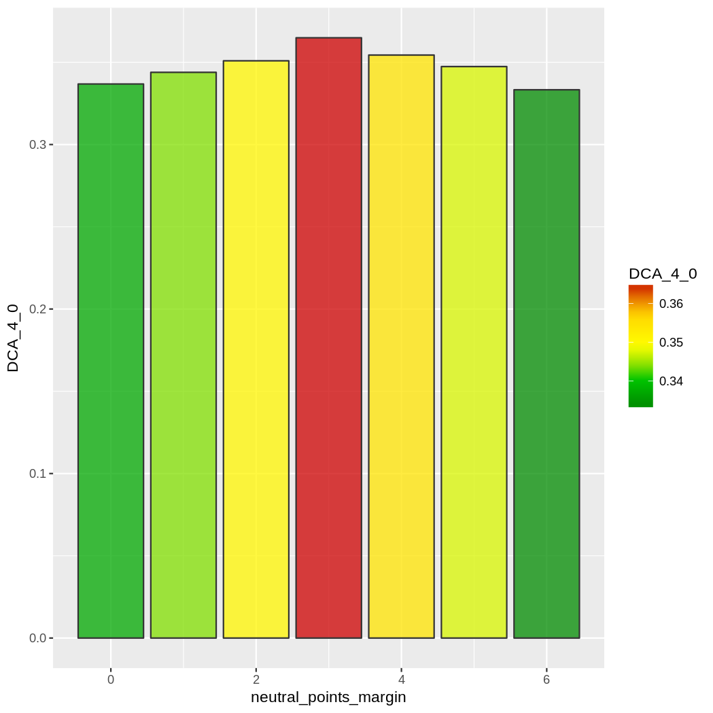

### Introduction

This is a case study that cans serve as a tutorial on how to start training and optimizing new prediction models (i.e. adapting P2Rank for new prediction tasks with new datasets).

### Prerequisites

Datasets located in `../p2rank-ions-data-rdk/` (cloned from https://github.com/rdk/p2rank-ions-data-rdk) relative to this repo.

Smaller subsets created from original training datasets:
* dataset-train.ds (n=2349, original dataset)
* dev200.ds (n=200)
* dev100.ds (n=100, subset of dev200.ds)
* dev200-inverse.ds (n=2149)
* train200.ds (n=200, subset of dev200-inverse.ds) 

See also `config/ions/ions-rdk.groovy` which will be used as a base config file.

### Development log

First we will try to use default confguration that was used to train P2Rank's ligand binding site (LBS) prediction model.

Sanity check first: train and eval datasets are the same.
~~~sh
./prank.sh traineval -label p2rank-default \
    -output_base_dir "../../p2rank-ions-results/" \
    -dataset_base_dir "../../p2rank-ions-data-rdk/" \
    -t 2020-01/mg/train200.ds \
    -e 2020-01/mg/train200.ds \
    -loop 1 -log_to_console 0 -log_to_file 1 -log_level ERROR  \
    -stats_collect_predictions 1 \
    -rf_trees 100
~~~     
Results:
~~~
3 minutes 49.33 seconds on 12 cores
DCA(4.0) = 88.4  
AUPRC:   0.9383  area under PR curve
AUC:     0.9999  area under ROC curve
F1:      0.9357  f-measure
MCC:     0.9375  Matthews correlation coefficient
~~~   
Looks good - almost perfect prediction.

Now for real test on dev dataset.
~~~sh
./prank.sh traineval -label p2rank-default \
    -output_base_dir "../../p2rank-ions-results/" \
    -dataset_base_dir "../../p2rank-ions-data-rdk/" \
    -t 2020-01/mg/train200.ds \
    -e 2020-01/mg/dev100.ds \
    -loop 1 -log_to_console 0 -log_to_file 1 -log_level ERROR  \
    -stats_collect_predictions 1 \
    -rf_trees 100
~~~     
Results:
~~~
3 minutes 43.55 seconds on 12 cores
DCA_4_0 = 15.4% (identification success rate for DCA (4A / Top n+0) criterion)
~~~                                 
This is terrible. P2Rank's LBS prediction model achieves ~70% even on similarly small datsets.

First we try to do some preliminary optimization of class balancing parameters using Bayesian optimization (hyperparameter-optimization-tutorial.md).
~~~sh
pkill python; sudo pkill mongo
./prank.sh hopt -c config/ions/ions-rdk -out_subdir HOPT -label balancing-01 \
    -t 2020-01/mg/train200.ds \
    -e 2020-01/mg/dev100.ds \
    -loop 1 -log_to_console 0 -log_to_file 1 -log_level ERROR  \
    -ploop_delete_runs 0 -hopt_max_iterations 2999 \
    -collect_only_once 0 \
    -clear_prim_caches 0 -clear_sec_caches 0 \
    -hopt_objective '"-DCA_4_0"' \
    -balance_class_weights 1 \
    -features '(chem,volsite,bfactor,protrusion)' \
    -rf_bagsize 55 -rf_depth 10 -rf_trees 40 \
    -target_class_weight_ratio '(0.001,0.2)' \
    -positive_point_ligand_distance '(1,10)' \
    -pred_point_threshold '(0.3,0.7)' \
    -pred_min_cluster_size '(1,5)'
~~~     
Results:
~~~       
After 85 steps (and cca 2 hours):

target_class_weight_ratio,        0.1726
positive_point_ligand_distance,       9.3741
pred_point_threshold,         0.7000
pred_min_cluster_size,        1.0000
value,       -0.3719 (-DCA_4_0)
~~~                                 
Some improvement but still very low success rate.

More comprehensive optimization on larger evaluation dataset dev200.ds with more trees.
Clearing caches (`-clear_prim_caches 1 -clear_sec_caches 1)`) since we are optimizing solvent radius. 
~~~sh
pkill python; sudo pkill mongo; \
./prank.sh hopt -c config/ions/ions-rdk -out_subdir HOPT -label balancing-06 \
    -t 2020-01/mg/train200.ds \
    -e 2020-01/mg/dev200.ds \
    -loop 1 -log_to_console 0 -log_to_file 1 -log_level ERROR  \
    -ploop_delete_runs 0 -hopt_max_iterations 2999 \
    -clear_prim_caches 1 -clear_sec_caches 1 \
    -hopt_objective '"-DCA_4_0"' \
    -balance_class_weights 1 \
    -atom_table_features '(atomicHydrophobicity)' \
    -features '(chem,volsite,bfactor,protrusion)' \
    -rf_bagsize 55 -rf_depth 12 -rf_trees 100 \
    -target_class_weight_ratio '(0.001,0.2)' \
    -positive_point_ligand_distance '(1,10)' \
    -pred_point_threshold '(0.3,0.7)' \
    -pred_min_cluster_size '(1,5)' \
    -extended_pocket_cutoff '(1,5)' \
    -point_score_pow '(0.5,10)' \
    -neighbourhood_radius '(5,8)' \
    -protrusion_radius '(7,12)' \
    -solvent_radius '(0.4,2)' 
~~~
Results:
~~~
After 848 steps:
target_class_weight_ratio,        0.0684
positive_point_ligand_distance,       5.1286
pred_point_threshold,         0.5678
pred_min_cluster_size,        1.0000
extended_pocket_cutoff,       1.0000
point_score_pow,         10.0000
neighbourhood_radius,         5.9003
protrusion_radius,        7.0000
solvent_radius,       1.2781
value,       -0.4007  (-DCA_4_0)
~~~
Looks like an improvement but hard to say. `protrusion_radius` and `point_score_pow` are on the edges intervals need to be extended next time. 

As an example of grid optimization we try to run it on `neutral_points_margin` parameter, which also influences class balance. 
(Points between (positive_point_ligand_distance, positive_point_ligand_distance + neutral_point_margin) will not be considered positives or negatives and will be left out form training.)
See Params.groovy for description of other parameters.

~~~sh
./prank.sh ploop -c config/ions/ions-rdk -out_subdir HOPT -label balancing-01-ploop-1 \
    -t 2020-01/mg/train200.ds \
    -e 2020-01/mg/dev100.ds \
    -loop 1 -log_to_console 0 -log_to_file 1 -log_level ERROR  \
    -ploop_delete_runs 0 -hopt_max_iterations 2999 \
    -clear_prim_caches 0 -clear_sec_caches 0 \
    -hopt_objective '"-DCA_4_0"' \
    -balance_class_weights 1 \
    -features '(chem,volsite,bfactor,protrusion)' \
    -rf_bagsize 55 -rf_depth 10 -rf_trees 40 \
    -target_class_weight_ratio 0.1726 \
    -positive_point_ligand_distance 9.3741 \
    -pred_point_threshold 0.7 \
    -pred_min_cluster_size 1 \
    -neutral_points_margin '(0,1,2,3,4,5,6)'
~~~     
Result:

Optimal value is around 3.

#### Confirmation run

Now let's move the results of previous optimizations to checkpoint config file `ions-rdk-c1.groovy`
and run further tests to confirm the results (avg. of 10 iterations with `-loop 10`) and produce visualizations. 

~~~sh
./prank.sh traineval -c config/ions/ions-rdk-c1 -out_subdir HOPT -label balancing-06-test-1 \
    -t 2020-01/mg/train200.ds \
    -e 2020-01/mg/dev200.ds \
    -loop 10

./prank.sh traineval -c config/ions/ions-rdk-c1 -out_subdir HOPT -label balancing-06-test-1-visualizations \
    -t 2020-01/mg/train200.ds \
    -e 2020-01/mg/dev200.ds \
    -loop 1 \
    -visualizations 1 \
    -stats_curves 1 \       # produce data for plotting ROC curve
    -log_cases 1            # produce overview stats of all ligands / pockets / proteins
~~~
Results (loop 10):
~~~           
Finished in 30 minutes on 12 cores.

DCA_4_0:  38.7
DCA_4_2:  42.2
DCA_4_99: 45.4     # how many were perdicted basically without regards to the ordering (i.e. Top-n+99)
AUPRC:     0.1618
AUC:       0.8203
~~~

### Calculating and testing propensity statistics features

Propensities of singe residues (20 AA codes), sequence duplets and triplets can be calculated from the 
dataset and used as additional features. 
We will use larger dev200-inverse.ds dataset.

Note: be mindful of data leakage. These statistical features shouldn't be used during evaluation on 
the same proteins they were calculated from. 

~~~sh
./prank.sh analyze aa-propensities        -c config/ions-rdk 2020-01/mg/dev200-inverse.ds   
./prank.sh analyze aa-surf-seq-duplets    -c config/ions-rdk 2020-01/mg/dev200-inverse.ds    
./prank.sh analyze aa-surf-seq-triplets   -c config/ions-rdk 2020-01/mg/dev200-inverse.ds 
~~~

Results need to be moved in to the codebase:
* Move `duplets.csv` and `triplets.csv` to `src/main/resources/tables/propensities/ions/Mg_Dev200Inv`.
* From `aa-propensities.csv` take columns `(pos_ratio, pos_ratio^2)` and add to `src/main/resources/tables/aa-propensities.csv` as `(Ions_Mg_Dev200Inv, Ions_Mg_Dev200Inv^2)`.

Note: these propensity features were added ad hoc during peptide binding site prediction, and the whole prosess should be redesigned.

Now we can use new features (after rebuild).
~~~
./prank.sh traineval -c config/ions-rdk -out_subdir HOPT -label propensity-features-1 \
    -t 2020-01/mg/train200.ds \
    -e 2020-01/mg/dev200.ds \
    -loop 3 -log_to_console 0 -log_to_file 1 -log_level ERROR \
    -ploop_delete_runs 0 -hopt_max_iterations 2999 \
    -collect_only_once 0 \
    -clear_prim_caches 1 -clear_sec_caches 1 \
    -hopt_objective '"-DCA_4_0"' \
    -balance_class_weights 1 \
    -residue_table_features '(Ions_Mg_Dev200Inv,Ions_Mg_Dev200Inv^2)' \
    -atom_table_features '(atomicHydrophobicity)' \
    -features '(chem,volsite,bfactor,protrusion,duplets_atomic,duplets_sas,triplets_atomic,triplets_sas)' \
    -feat_propensity_tables 'ions/Mg_Dev200Inv' \
    -rf_bagsize 55 -rf_depth 12 -rf_trees 100 \
    -target_class_weight_ratio 0.0684 \
    -positive_point_ligand_distance 5.1286 \
    -pred_point_threshold 0.5678 \
    -pred_min_cluster_size 1 \
    -extended_pocket_cutoff 1 \
    -point_score_pow 10 \
    -neighbourhood_radius 5.9 \
    -protrusion_radius 7 \
    -solvent_radius 1.2781 
~~~

