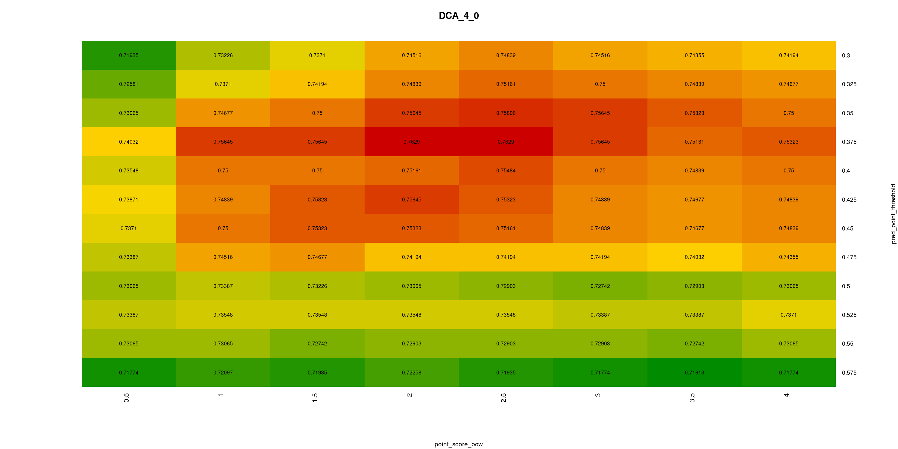

# Implementing and evaluating new feature

Read this if you want to implement a new feature and evaluate if it contributes to prediction success rates.

## Implementation

New features can be added by implementing `FeatureCalculator` interface and registering the implementation in `FeatureRegistry`.
You can implement the feature by extending one of the convenience abstract classes `AtomFeatureCalculator` or `SasFeatureCalculator`.

You need to decide if the new feature will be associated with protein surface (i.e. solvent exposed) atoms or with SAS points (SAS=Solvent Accessible Surface). 
P2Rank works by classifying SAS point feature vectors. 
If you associate the feature with atoms, its value will be projected to SAS point feature vectors by P2Rank from neighbouring atoms.

Some features are more naturally defined for atoms rather than for SAS points and other way around. See `BfactorFeature` and `ProtrusionFeature` for comparison.

## General evaluation

 1. Prepare the environment (see _Preparing the environment_ in `training-tutorial.md`)

 2. Check `config/train-default.groovy` config file. It contains configuration ideal for training new models, but you might need to make changes or override some params on the command line. 
 
 3. Train with the new feature
    * train with the new feature by adding its name to the list of `-features`. e.g.:
        - in the groovy config file: `features = ["protrusion","bfactor","new_feature"]`
        - on the command line: `-features '(protrusion,bfactor,new_feature)'` 
    * if the feature has arbitrary parameters, they can be optimized with `prank ploop` or `prank hopt` commands
        - see the [hyperparameter optimization tutorial](hyperparameter-optimization-tutorial.md) 
    * you can even compare different feature sets running `prank ploop ...`. e.g.:
        - `-features '((protrusion),(new_feature),(protrusion,new_feature))'`
          

Note: due to the variance in trained classifiers it is important to consider average results of several runs (by using e.g `-loop 10`) when comparing features.

## Feature importances

See 'Feature importances' section in [training tutorial](training-tutorial.md).  

## Evaluating new feature 

_(this section is work in progress)_

How to evaluate wheather the new feature is useful?
Is it helping to predict more binding sites, and/or more precisely predict their shape? 
                                                   
This question is more complicated that it may seem. 
                                   
* Short answer: If it improves `point_AUPRC`, it is discriminative, and it has a potential to help P2Rank to make better predictions.
* Slightly longer answer: Better way to compare models is using `DCA` metrics (`DCA_4_0`,`DCA_4_2`...) in combination with some metric 
  that takes into account pocket shapes, like `LIGAND_COVERAGE` or `DSWO_05_0` metric. 
* More complete answer: Even if `point_AUPRC` is improved, DCA and other pocket matrics may stay roughly the same, or even get worse. 
  The reason is that adding new feature can substantially change the distribution of predicted SAS point scores.
  `DCA` and other pocket metrics then depend on some parameters that were optimized on a diffrent score distribution.
  To get a meaningful comparison of `DCA` metrics, it is necessary to perform optimization of at least some basic parameters (`pred_point_threshold`, `point_score_pow`).
             
      
Details and a case study follows.           

### Introduction to metrics

* pocket prediction metrics
    - `DCA_4_0` - (considering top n+0 pockets)
    - `DCA_4_2` - (considering top n+2 pockets)
    - `DSWO_05_0`- discretized surface weighted overlap: pocket is considered correctly predicted iff
      at least 0.5 (50%) of the ligand is covered by the pocket and
      at least 0.2 (20%) of the pocket is covered by the ligand
      (considering top n+0 pockets). Discretized because it is not based on a real volume but on the count of SAS points as proxy of the volume.
    - `LIGAND_COVERAGE` - what % of ligands (in terms of volume) is covered by positively predicted SAS points. Discretized as `DSWO_05_0`.
* point metrics 
    - `point_AUPRC`
    - `point_AUC`
    - `point_MCC`  
* resdue metrics
    - `residue_AUPRC`
    - `residue_AUC`
    - `residue_MCC`

There are 3 related but distinct problems that should be distinguished:
1. Problem of predicting ligand biding sites.
2. Binary classification problem of predicting ligandablity of SAS points.
3. Binary classification problem of predicting binding residues.

We are mainly focused on 1., while considering 3. just a poor way of looking at and evaluating binding site prediction methods.
(It was used mainly for algorithms that predict just from sequence because it is the most natural -- or rather, the easiest.)
Considering 2. can give a useful hints while training and optimizing new model to be better at 1.

Why are the residue metrics inadequate? See the discussion on 'Residue-centric versus pocket-centric perspective'
in the [paper](https://doi.org/10.1186/s13321-018-0285-8).       

Note: residue metrics are available only when P2Rank is executed in residue mode (`-predict_residues 1`). 
Default P2Rank models are not optimized for residue metrics.

### Case study - conservation feature

#### First, we run training and evaluation for models with and without conservaion to illustrate mentioned poits.
                                     
Notes: 
* The default model was trained with `-sample_negatives_from_decoys 1` and the default conservation model with `-sample_negatives_from_decoys 0`.
  Here we need to use the same value: otherwise the distribution of positve and negative instances (SAS points) would be different 
  and `point_AUPRC` and `point_AUC` would be uncomparable.
* Training on `chen11-fpocket.ds` because we are using `sample_negatives_from_decoys 1`.                   
* `-loop 10` does 10 runs with different random seed and averages results.

~~~bash
./prank.sh traineval -t chen11-fpocket.ds -e joined.ds -c config/train-default -out_subdir CASE -label DEFA \
    -sample_negatives_from_decoys 1 \
    -loop 10 
    
    # point_SCORE_AVG,        0.0571
    # point_SCORE_VARIANCE:   0.0114
    # point_SCORE_KURTOSIS:  20.4223
    # point_SCORE_SKEWNESS:   4.0101
    # point_AUPRC: 0.3563
    # point_AUC:   0.9175
    # point_MCC:   0.3928
    # DCA_4_0:   0.7521
    # DCA_4_0_NOMINAL: 4663
    # DCA_4_2:   0.8144
    # LIGAND_COVERAGE:  0.5571
    # DSWO_05_0:   0.7150

./prank.sh traineval -t chen11-fpocket.ds -e joined.ds -c config/train-conservation -out_subdir CASE -label CONS \
    -conservation_dirs '(chen11/conservation/e5i1/scores,joined/conservation/e5i1/scores)' \
    -sample_negatives_from_decoys 1 \
    -loop 10 
    
    # point_SCORE_AVG:        0.0580
    # point_SCORE_VARIANCE:   0.0118
    # point_SCORE_KURTOSIS:  19.9084
    # point_SCORE_SKEWNESS:   3.9637
    # point_AUPRC: 0.3740
    # point_AUC:   0.9231
    # point_MCC:   0.4079
    # DCA_4_0:   0.7519
    # DCA_4_0_NOMINAL: 4662
    # DCA_4_2:   0.8006
    # LIGAND_COVERAGE:  0.5866
    # DSWO_05_0:   0.7106
    
~~~
   
Conclusions: 
* `point_SCORE_*` metrics show that predicted SAS point scores have somewhat different distributions.
* `point_AUPRC` and `point_AUC` suggest that conservation helps to train better classifier
* however, `DCA` metrics for conservation are slightly worse (although, for `DCA_4_0` only by 1 pocket)
* `LIGAND_COVERAGE` furthermore sugest that conservation helps to make better predictions (pockets better covering the ligands)

#### Next, we take a look how 2 parameters influence `DCA` metrics.

Parameters:
* `pred_point_threshold`:  if predicted score of SAS point is >= `pred_point_threshold`, 
  the point is classified as positive (=ligand binding) and such points are clustered to form pockets.  
* `point_score_pow`: exponent applied to the point score before it is included in the cumulative score of the pocket. 
  Values higher than 1 give unlinearly higher "weight" to the points whith a higher predicted scores. Helps to give higher pocket
  score to a smaller pockets which are predicted with higher "certainty".
        
We run `ploop` comand to try different combination of parameter values and to produce 2D heatmap charts.

~~~bash
./prank.sh ploop -t chen11-fpocket.ds -e joined.ds -c config/train-default -out_subdir CASE -label GRID_DEFA \
    -sample_negatives_from_decoys 1 \
    -hopt_train_only_once 1 \
    -pred_point_threshold '[0.3:0.7:0.025]' \
    -point_score_pow '[0.5:5:0.5]'

./prank.sh ploop -t chen11-fpocket.ds -e joined.ds -c config/train-conservation -out_subdir CASE -label GRID_CONS \
    -conservation_dirs '(chen11/conservation/e5i1/scores,joined/conservation/e5i1/scores)' \
    -sample_negatives_from_decoys 1 \
    -hopt_train_only_once 1 \
    -pred_point_threshold '[0.3:0.7:0.025]' \
    -point_score_pow '[0.5:5:0.5]'
~~~

Notes:
* `-hopt_train_only_once 1` causes that only one RF model is trained in the beginning and then it is simply evaluated for every point (parameter values).
* Ideally, it should be executed with `-hopt_train_only_once 0 -loop 10` but that would be computationally very expensive.
* Now, the results also capure peculiarties of the one particular trained RF model, but for illustration it is hopefully sufficient.

Results:

Without conservation (heatmap of `DCA_4_0`, x: `point_score_pow` y: `pred_point_threshold`):  

With conservation (heatmap of `DCA_4_0`, x: `point_score_pow` y: `pred_point_threshold`):    

Conclusions: 
* Model with conservation might achieve better `DCA` results (as expected) when parameters are properly optimized.

#### Running bayesian optimization
                                                                                         
We can try to optimize those 2 parameters with bayesian optimization. For the instructions how to set it up see [optimization tutorial](hyperparameter-optimization-tutorial.md).

This time, we can afford to properly evaluate the average results of 5 runs with different random seed for each ponint. 

~~~bash
./prank.sh hopt -t chen11-fpocket.ds -e joined.ds -c config/train-default -out_subdir CASE -label BOPT_DEFA \
    -sample_negatives_from_decoys 1 \
    -hopt_optimizer 'pygpgo' \
    -hopt_python_command 'python3' \
    -hopt_objective 'DCA_4_0' \
    -loop 5 \
    -pred_point_threshold '(0.2,0.6)' \
    -point_score_pow '(1,5)'

./prank.sh hopt -t chen11-fpocket.ds -e joined.ds -c config/train-conservation -out_subdir CASE -label BOPT_CONS \
    -conservation_dirs '(chen11/conservation/e5i1/scores,joined/conservation/e5i1/scores)' \
    -sample_negatives_from_decoys 1 \
    -hopt_optimizer 'pygpgo' \
    -hopt_python_command 'python3' \
    -hopt_objective 'DCA_4_0' \
    -loop 5 \
    -pred_point_threshold '(0.2,0.6)' \
    -point_score_pow '(1,5)'
~~~

Notes:
* Optimization is finished after 1000 steps by default (`hopt_max_iterations` parameter)
  but more likely it would be stopped manually.
* Results of the optimization will be in `hopt/best.csv`.  

